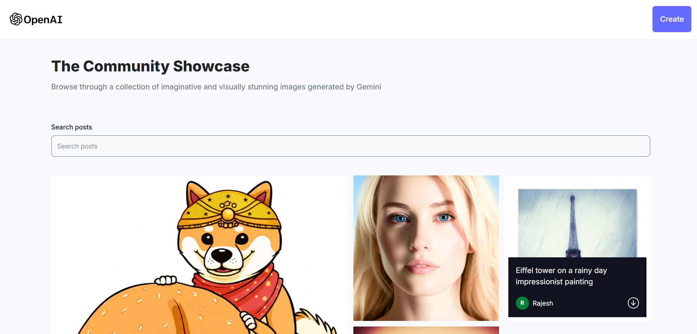
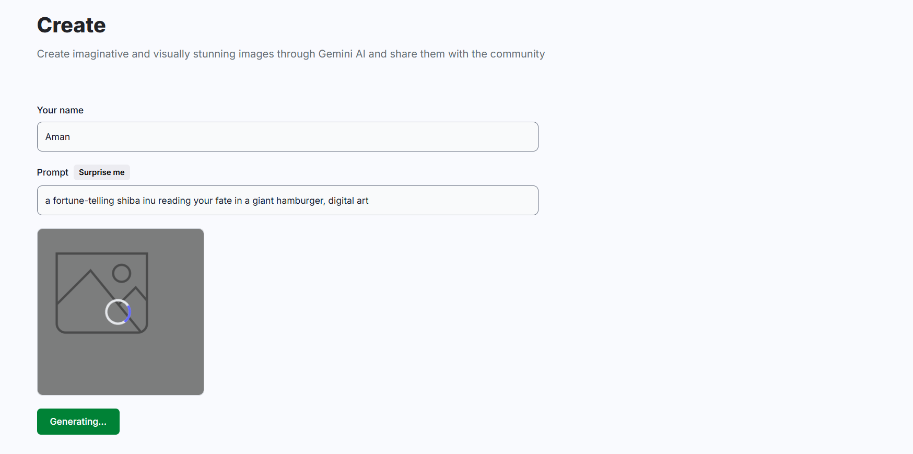
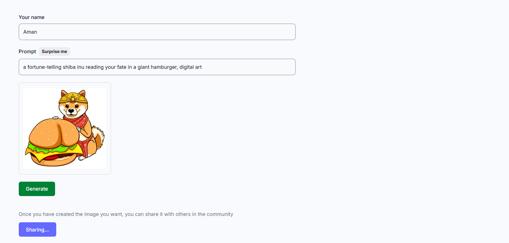

# 🖼️ img-generator

A MERN‑stack application powered by **Gemini 2.0** for AI-driven image generation and a built-in community platform for sharing creations.

---

## 🚀 Features

- **AI Image Generation**: Seamlessly create images using Gemini 2.0’s API.
- **Community Feed**: Users can view AI generated images posted by others.
- **Share to Community**: Support for posting AI-generated images.
- **Download and view details**: User can hover over the image to view the prompt and user who posted it. They can also download using the download button.
- **Search Community Posts**: Support for search AI-generated images.
- **Responsive Design**: Mobile-first UI with React, styled-components, or CSS frameworks.

---

 <!-- Replace -->
 <!-- Replace -->
 <!-- Replace -->
 <!-- Replace -->

## 🧱 Tech Stack

| Layer     | Framework & Tools                                    |
| --------- | ---------------------------------------------------- |
| Backend   | Node.js, Express.js                                  |
| Database  | MongoDB with Mongoose, Cloudinary for storing images |
| Image API | Gemini 2.0 (Google AI image generation)              |
| Frontend  | React.js                                             |

---

## ⚙️ Installation & Development

1. **Clone the repo**

   ```bash
   git clone https://github.com/ArnabDey31/img-generator.git
   cd img-generator
   ```

2. **Install dependencies**
   ```bash
   cd server && npm install
   cd ../frontend && npm install
   ```
3. **Configure environment variables**

   Create a .env file inside the server directory:

   ```bash
   MONGODB_URI=<your MongoDB connection string>
   API_KEY=<your Gemini 2.0 API key>
   CLOUDINARY_CLOUD_NAME=<your cloudinary cloud name>
   CLOUDINARY_API_KEY=<your cloudinary api key>
   CLOUDINARY_API_SECRET=<your cloudinary api secret>
   ```

4. **Run the App**
   ```bash
   cd server && npm start
   cd ../frontend && npm run dev
   ```
5. **Launch the App**

   http://localhost:5173/
